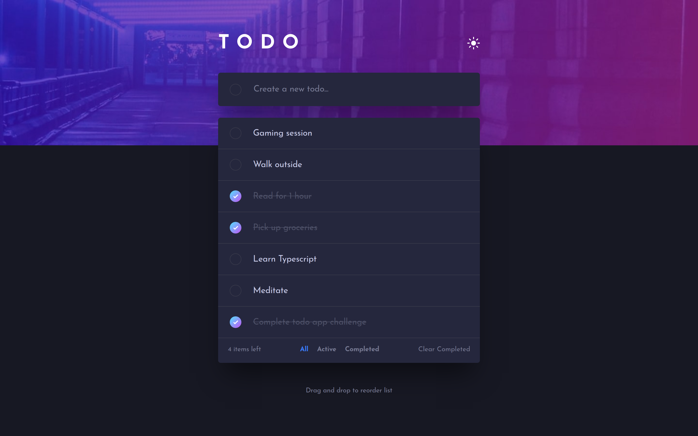

# Frontend Mentor - Todo app solution

This is a solution to the [Todo app challenge on Frontend Mentor](https://www.frontendmentor.io/challenges/todo-app-Su1_KokOW). Frontend Mentor challenges help you improve your coding skills by building realistic projects. 

## Table of contents

- [Overview](#overview)
  - [The challenge](#the-challenge)
  - [Screenshot](#screenshot)
  - [Links](#links)
- [My process](#my-process)
  - [Built with](#built-with)
  - [What I learned](#what-i-learned)
- [Author](#author)
- [Acknowledgments](#acknowledgments)
- [License](#license)

## Overview

### The challenge

Users should be able to:

- View the optimal layout for the app depending on their device's screen size
- See hover states for all interactive elements on the page
- Add new todos to the list
- Mark todos as complete
- Delete todos from the list
- Filter by all/active/complete todos
- Clear all completed todos
- Toggle light and dark mode
- **Bonus**: Drag and drop to reorder items on the list

### Screenshot

| Mobile (375px) | Desktop (1440px) |
| --- | --- |
|  |  |

### Links

- [Solution URL](https://www.frontendmentor.io/solutions/fullstack-todo-app-using-react-and-supabase-rJDd0gpMc)
- [Live Site URL](https://todo-app-elidrissidev.vercel.com)

## My process

### Built with

- Semantic HTML5 markup
- CSS custom properties
- Flexbox
- Mobile-first workflow
- [React](https://reactjs.org/) - JS library
- [React Query](https://react-query.tanstack.com/) - For server-side state fetching and caching.
- [React Beautiful Dnd](https://github.com/atlassian/react-beautiful-dnd/) - For drag & drop functionality.
- [Supabase](https://supabase.com/) - For backend

### What I learned

This was a pretty challenging challenge! I learned how to separate fetching logic to a custom hook (`useTodos`), I also got to use Supabase for the first time which I found to be very interesting, I really like how it gives you access to the full Postgres database without limitations!

Another thing I struggled with at first is the drag and drop ordering of the todo items, which I almost gave on after trying with `react-dnd`. Luckily, the Slack community didn't fail to provide help! I was recommended to switch to `react-beautiful-dnd` which I found to be very easy to use, oh and I also like the animation when dragging an item!

## Author

- Website - [Mohamed ELIDRISSI](https://www.elidrissi.dev)
- Frontend Mentor - [@elidrissidev](https://www.frontendmentor.io/profile/elidrissidev)
- Twitter - [@elidrissidev](https://www.twitter.com/elidrissidev)

## Acknowledgments

Thanks to \@MikeMT from the Slack community for his time, and to \@Chamu for recommending to switch to `react-beautiful-dnd` for the drag & drop functionality.

## License

This project is licensed under the [MIT License](LICENSE).
